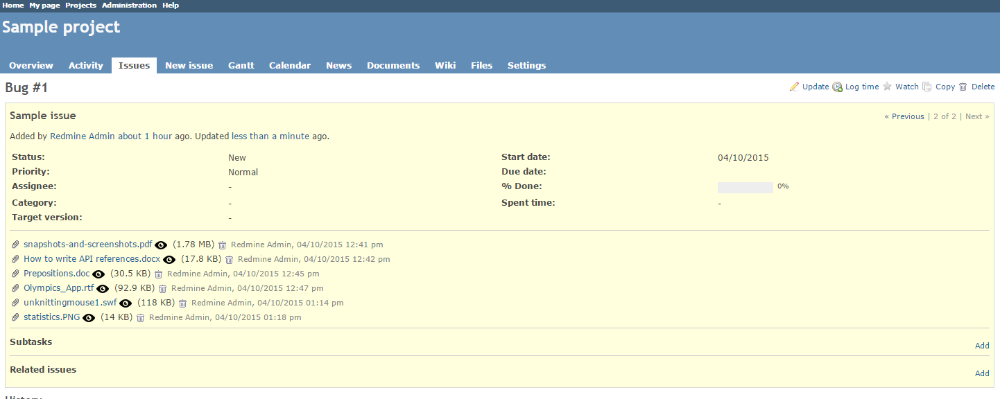
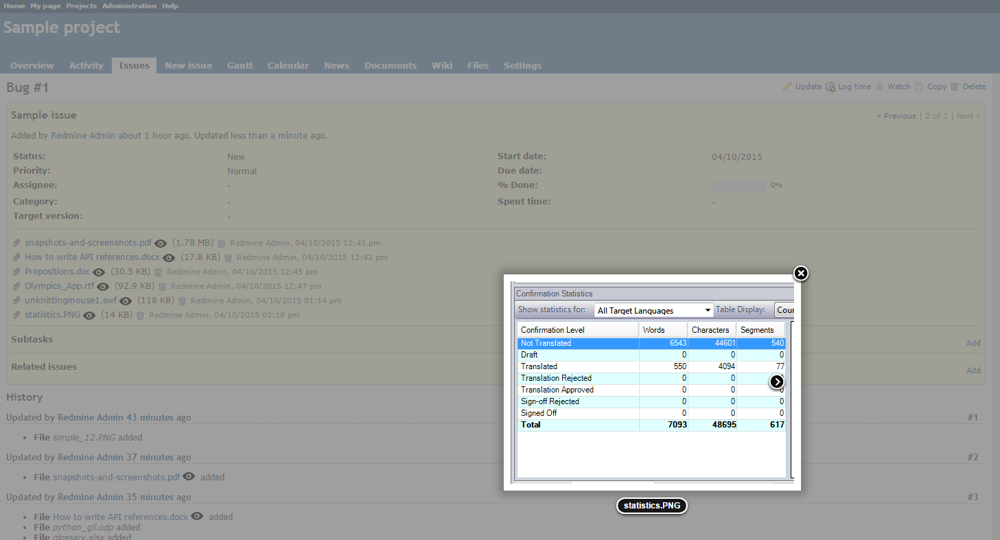

# Redmine Lightbox Plugin

This plugin enables you to preview the files attached to issues in Redmine. The plugin currently supports various image (.png, .jpg, .gif, .swf, etc.) and document (,pdf, .docx, .doc, .rtf) formats.

The initial author is [Genki Zhang](https://github.com/zipme/redmine_lightbox).

## Compatibility

This plugin version is compatible only with Redmine 2.1.x and later.

## Installation

1. To install the plugin
    * Download the .ZIP archive, extract files and copy the plugin directory into #{REDMINE_ROOT}/plugins.
    
    Or

    * Change you current directory to your Redmine root directory:  

            cd {REDMINE_ROOT}
            
      Copy the plugin from GitHub using the following commands:
      
            git clone https://github.com/Undev/notify_custom_users.git plugins/notify_custom_users
            
2. Install the required dependencies using the command:

        sudo apt-get install libreoffice-common unoconv

3. Install the required gems using the command:  

        bundle install  
      
4. These plugins require a migration. Run the following command to upgrade your database (make a database backup before):  

        bundle exec rake redmine:plugins:migrate RAILS_ENV=production
            
5. Restart Redmine.

## Usage

The plugins adds an **eye** icon next to issue attachments that can be previewed.  

Clicking the icon opens a pop-up window where you can preview the attachment. If there are several files attached to the issue, you can proceed to the next attachment by clicking the arrow button.

## License

This plugin is published under the MIT license.